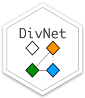

------------------------------------------------------------------------

# DivNet 
  
<!-- badges: start -->

[](https://github.com/adw96/DivNet/actions/workflows/R-CMD-check.yaml) [](https://codecov.io/gh/adw96/DivNet?branch=master) <!-- badges: end -->

DivNet: an R package to estimate diversity when taxa in the community cooccur via a ecological network.

Willis, A.D. and Martin, B.D. (2020) [*DivNet: Estimating diversity in networked communities*](https://academic.oup.com/biostatistics/advance-article-abstract/doi/10.1093/biostatistics/kxaa015/5841114). Biostatistics. doi.org/10.1093/biostatistics/kxaa015

## About

If you knew the exact composition of a community (such as all of the microbes living on your skin), you could calculate the Shannon diversity of the community, or the Bray-Curtis distance between your skin’s microbes and your cat’s fur microbes. However, you will only ever observe a small fraction of the microbes on your skin from your experiment, so you have to estimate these diversity indices based on the data, and ideally you will get a confidence interval for those diversity indices.

Almost all ecologists use “plug-in” diversity estimates, obtained by taking the observed relative abundances of each taxon and plugging them into the formula for the true diversity. This is problematic for a number of reasons, including that there may be unobserved taxa, and the observed relative abundances probably don’t exactly equal the true relative abundances due to random sampling. Furthermore, typical approaches to obtaining a confidence interval assume that all taxa behave independently: if taxon A is there, this tells you nothing about whether taxon B is likely to be there too. DivNet takes care of all of these issues, and gives you a confidence interval that incorporates all of these challenges.

See [the vignette](https://github.com/adw96/DivNet/blob/master/vignettes/getting-started.Rmd) for a full tutorial, and [the paper](https://academic.oup.com/biostatistics/advance-article-abstract/doi/10.1093/biostatistics/kxaa015/5841114) for more details.

Want a confidence interval for a different diversity index? Let us know by posting an [issue](https://github.com/adw96/DivNet/issues)!

## Installation

`DivNet` is currently available via GitHub, and can be installed as follows. Please note that you will need to install the latest version of `breakaway` to install `DivNet`; this is included in the following commands:

``` r
# install.packages("remotes")   ## run this line if you do not already have remotes installed
remotes::install_github("adw96/breakaway")
remotes::install_github("adw96/DivNet")
library(DivNet)
```

## Basic Usage

Let’s analyse the Lee *et al.* dataset using DivNet. We could analyse at the ASV level, but to keep things simple let’s analyse the phylum level diversity.

``` r
library(phyloseq)
data(Lee)
divnet_phylum <-  divnet(tax_glom(Lee, taxrank="Phylum"),
                         X = "char",
                         ncores = 4)
divnet_phylum
```

To test if alpha-diversity (by default, Shannon) is equal across the values of the covariate X, we can run

``` r
testDiversity(divnet_phylum)
```

and to plot the DivNet estimates of diversity we can run

``` r
library(ggplot2)
plot(divnet_phylum)
```

## Advanced Usage (for large datasets)

One limitation of DivNet is that it is slow when you have many taxa (thousands and upwards). Fortunately for us, the amazing [Ryan Moore](https://www.tenderisthebyte.com/) implemented a faster version of DivNet in Rust called [divnet-rs](https://github.com/mooreryan/divnet-rs). Check out the documentation [here](https://github.com/mooreryan/divnet-rs).

Unfortunately the StatDivLab do not have expertise with `divnet-rs`, so please direct your questions about `divnet-rs` to Ryan and the `divnet-rs` team (`divnet-rs` Issues page [here](https://github.com/mooreryan/divnet-rs/issues)).

## Integration

DivNet integrates with

-   [phyloseq](https://joey711.github.io/phyloseq/) (for reproducible microbiome analysis)
-   [breakaway](https://github.com/adw96/breakaway) (for hypothesis testing)

